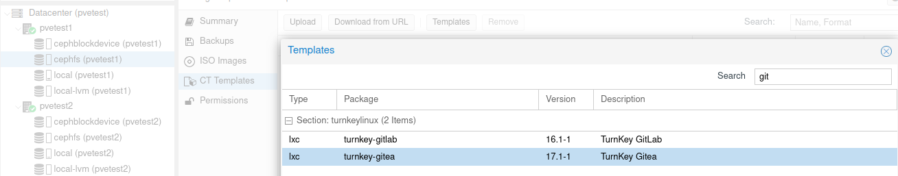
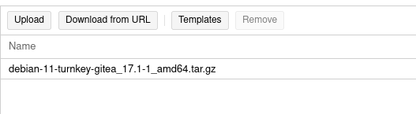
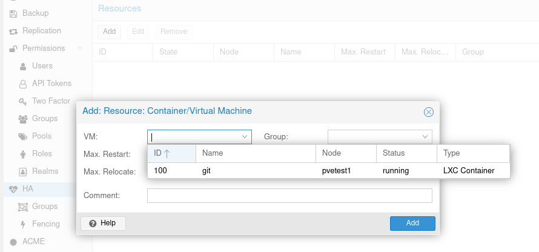
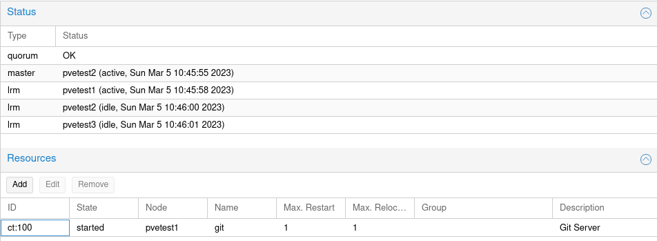

# Git Server

I chose [gitea](https://gitea.io/) for my server. It is lightweight and does exactly what I need it to do.

This is the first component to be installed because it is required to bootstrap the cluster.

# Linux Container (LXC)

LXC containers are natively supported by Proxmox and a VM is not needed for a linux native service like gitea.

## Getting a container template

I store my container templates on the shared `cephfs` storage.

`pvetest1` --> `cephfs` --> `CT Templates` then click on the `[Templates]` button to download a template.

Pick the `gitea` template and download it.

## Create the container

At the top there is a blue button labeled `[Create CT]`, use this to create your container.

### `General` tab

Set `Hostname` to `git`, configure password for root and upload your public SSH key.

### `Template` tab

Select the gitea template (`debian-11-turnkey-gitea_17.1-1_amd64.tar.gz` at time of writing)

### `Disks` tab
Be sure to select `cephblockdevice` so that the container is available on all nodes.

### `Network` tab
**Default is an empty static IP address!**

Either set the `IP Address` or select `dhcp`, or networking won't work.

Remember to set the `VLAN Tag` if required.

## Configure High Availability for the container

Navigate to the High Availability settings (`Datacenter` --> `HA`) and add the git server as a new resource.

The HA will change to reflect the new status:

# Configure the gitea server

For configuration details see the [turnkey linux documentation](https://www.turnkeylinux.org/gitea) and the
[gitea documentation](https://docs.gitea.io/en-us/).

It will ask for a strong `admin` password, use a password manager and not something simple like `giteaP455!`. 