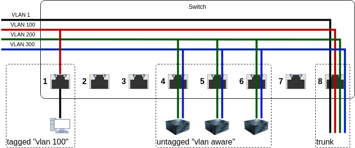

# Proxmox Virtualization Environment

I choose [Proxmox Virtualization Environment](https://www.proxmox.com/en/proxmox-ve) because it is an easy to
use virtualization platform that comes with an integrated high availability storage system [Ceph](https://ceph.com/).

## Getting Proxmox and installing Proxmox

You can download Proxmox at it's download site [here](https://www.proxmox.com/en/downloads/category/proxmox-virtual-environment).

I use [Ventoy](https://ventoy.net/) to keep all my bootable images on a single stick.

See:
* [Get started](https://www.proxmox.com/en/proxmox-ve/get-started)
* [Cluster Manager](https://pve.proxmox.com/pve-docs/chapter-pvecm.html)
* [Deploy Hyper-Converged Ceph Cluster](https://pve.proxmox.com/pve-docs/chapter-pveceph.html)
  * Optional: Define 2.5GB/S Adapter for ceph synchronization

[Documentation](https://pve.proxmox.com/pve-docs/)

To disable enterprise repository and stop the *unauthorized error* during refresh, edit `/etc/apt/sources.list.d/pve-enterprise.list`
and comment out the repository with a `#` symbol.
```
# deb https://enterprise.proxmox.com/debian/pve bullseye pve-enterprise
```

## Network

Customizations that I did for the network adapters are related to VLAN support and image migration within the cluster.

### Configure single adapter for VLAN support

*This is only required if you are using VLANs **and** the server only has a single NIC*

If you are using managed (smart) switches with virtual LANs (VLAN) then you will probably want Proxmox to be able to
handle them correctly for your containers and VMs.

Here the switch has been configured to connect VLANs 200 and 300 to ports 4-6, where the proxmox servers are connected.



To access the proxmox management interface when VLANs are being used, the NIC has to be configured to *VLAN aware*.

On my systems, the management VLAN has the id `3`.


<dl>
<dt>eno1</dt><dd>Network adapter - LAN</dd>
<dt>enp1s0</dt><dd>Network adapter - Storage</dd>
<dt>vmbr0</dt><dd>Internal bridge to connect to eno1</dd>
<dt>vmbr0.3</dt><dd>Connected to VLAN 3 on the bridge</dd>
</dl>

I followed the excellent YouTube tutorial "[How To Create VLANs in Proxmox For a Single NIC](https://www.youtube.com/watch?v=ljq6wlzn4qo)" by [David McKone](https://www.youtube.com/@TechTutorialsDavidMcKone).

### Image Migration

As I mentioned in the hardware section, I also have a second NIC for my cluster internal storage connections.

You have to explicitly tell Proxmox to use that NIC for migrating images.

This is found at `Datacenter` --> `Options` --> `Migration Settings`, on my systems I have selected the second adapter
`enp1s0` for migration.

## Ceph

Ceph isn't installed by default, so install Ceph, select `Datacenter` --> `Ceph` and you will see this message:


Install it and configure it as described in the "[Deploy Hyper-Converged Ceph Cluster](https://pve.proxmox.com/pve-docs/chapter-pveceph.html)"
documentation.

Part of the Ceph installation shows the `Configuration` tab, in the `Cluster Network IP/CIDR` field you can configure
Ceph to use the network on the second adapter.


### Configuring Ceph

I start a monitor and manager on each node (`Ceph` --> `Monitor`):


The storage devices on each node have to be added (`Ceph` --> `OSD`):


Create a shared `CephFS` filesystem and start a `Metadata Server` on each node (`Ceph` --> `CephFS`):


Create a shared `Block Storage` Device, I called mine `cephblockdevice`  (`Ceph` --> `Pools`):


You should now see the shared resources in the Datacenter panel:


### Enable RADOS Gateway (S3 support)

Grafana Loki requires S3 support for HA storage in a cluster, you have to manually configure the RADOS gateway to enable
that in Ceph.

I followed the instructions that Grin published in the [Proxmox Wiki](https://pve.proxmox.com/wiki/User:Grin/Ceph_Object_Gateway). 
