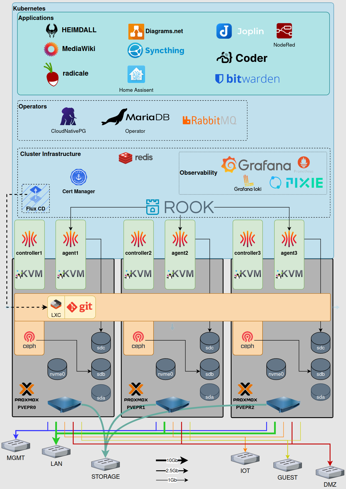

# Setting up a high availability SoHo cluster

***Very much work in progress, but release early and release often . . .***

The goal of this project is to learn Kubernetes and at the end of the day, to have a high availability
mini cluster for SoHo tasks. So the result is not so much directed to a 'Home Lab' but more in the
direction of 'Self Hosting', a blurry line to be sure. But you don't really need HA for a home lab.

Let me get one thing out if the way first: I am only providing this information as a **guide**, use it at your own risk.
I am not responsible for anything that happens to you, your property and especially your data.

**I am assuming that anyone attempting this has a good level of technical knowledge, so I'll only be
detailing information relevant to the pitfalls I encountered getting the cluster up and running.**

# Hardware

I am using [3 old small form factor office PCs](docs/Hardware.md) for the cluster.

# Software

I am using **Infrastructure as Code** where ever possible to have a repeatable configuration.

I also use software from the [Cloud Native Computing Foundation](https://www.cncf.io/) (CNCF) projects where ever
possible. Check out the [CNCF Cloud Native Interactive Landscape](https://landscape.cncf.io/) to see what is available. 

With the various pieces of the hardware in place and bootable, time to get the server up and running and start
installing the infrastructure.

# Building the cluster

1. Virtual Machines - [Proxmox VE](docs/Proxmox.md)
2. Cluster configuration - [Gitea Server](docs/Gitea.md)
3. Infrastructure as code (OpenTofu) - [Creating the virtual machines for the Kubernetes nodes](docs/openTofu/README.md)
4. Configuring a Talos based [Kubernetes cluster](docs/talos/README.md)
5. Bootstrapping the cluster using [Flux CD](docs/Flux.md)
6. Cluster certificate management with [Cert-Manager](docs/Cert-Manager.md)
7. Setting up the network with [cilium](docs/cilium/README.md)
8. Adding a cluster hosted [DNS server](docs/clusterdns/README.md)
9. Attaching [storage](docs/storage/README.md)
10. Database management using [database operators](docs/Database-Operators.md)
11. Setting up the first [applications](docs/apps/README.md)

Inspiration and references:

All of these creators are an absolute wealth of knowledge and gave me a ton of inspiration to do this project.

* [Tim Stewart](https://technotim.live/) (YouTube: [Techno Tim](https://www.youtube.com/@TechnoTim))
  * [The members of Tim's awesome discord server](https://l.technotim.live/discord)
  * [Proxmox](https://www.youtube.com/watch?v=GoZaMgEgrHw&list=PL8cwSAAaP9W37Vnxkw6__sshVY-XohWNm)
* [Jeff Geerling](https://www.youtube.com/@JeffGeerling)
  * [Pi Cluster](https://www.pidramble.com/)
  * [Ansible 101](https://www.youtube.com/watch?v=goclfp6a2IQ&list=PL2_OBreMn7FqZkvMYt6ATmgC0KAGGJNAN)
* [Marcel Dempers](https://www.youtube.com/@MarcelDempers) (That DevOps Guy)
  * [Kubernetes GitOps with Flux](https://www.youtube.com/watch?v=OFgziggbCOg)
* [Victor Farcic](https://www.youtube.com/@DevOpsToolkit) (DevOps Toolkit)
  * [Kubernetes](https://www.youtube.com/watch?v=Twtbg6LFnAg&list=PLyicRj904Z9-L3XdyttvdPwRngIfGa52Y)
* [Patrick Kennedy](https://www.youtube.com/@ServeTheHomeVideo) (ServeTheHome)
  * [Project TinyMiniMicro](https://www.youtube.com/watch?v=bx4_QCX_khU&list=PLC53fzn9608B-MT5KvuuHct5MiUDO8IF4)
* [David McKone](https://www.youtube.com/@TechTutorialsDavidMcKone) (Tech Tutorials - David McKone)
  * [How To Create VLANs in Proxmox For a Single NIC](https://www.youtube.com/watch?v=ljq6wlzn4qo)

**I wholeheartedly und unreservedly, recommend you subscribe to them all!**

# Back up your data!

**Now you are self-hosting, you are the system administrator, so don't forget to back up your data!**

Proxmox allows you to configure snapshots and automated backups, configure and use them.

Don't forget the 3-2-1 rule - **Have a minimum of 3 backups, 2 local on separate devices and 1 offsite!**

---
[Bill Mair](https://github.com/red-lichtie)
[Original document](https://github.com/red-lichtie/homelab-cluster/)
