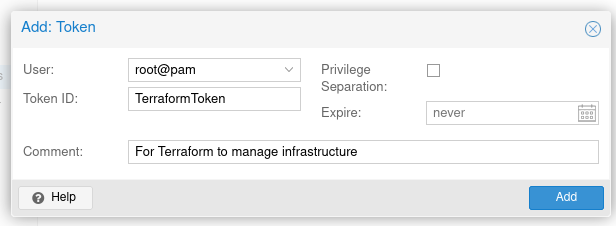
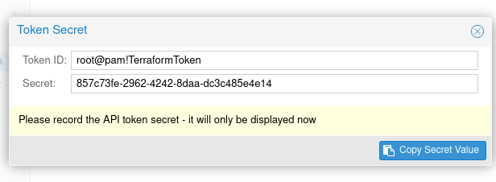

# Create kubernetes node using "Infrastructure as Code" (IaC)

You could manually define all the nodes in your Kubernetes cluster but that is error-prone, so I use
[Terraform](https://www.terraform.io/) to define and create the cluster nodes.

# Proxmox

You have to have a remote access API key with full administrator rights.

`Datacenter` --> `Permissions` --> `API Tokens` -- `[Add]`

Create a new token for `root@pam`, the `Token ID` (`TerraformToken`) is the name of the token and also deselect `Priviledge Separation [ ]`.



You'll the details for the generated token:


<dl>
<dt>Token ID</dt><dd>`root@pam!TerraformToken`</dd>
<dt>Secret</dt><dd>`857c73fe-2962-4242-8daa-dc3c485e4e14`</dd>
</dl>

Record the details somewhere, like BitWarden, you'll need the secret for terraform to use the token.

# Terraform

Configure the nodes using [Terraform](https://www.terraform.io/).

## Proxmox provider

To access Proxmox you'll need the [Terraform provider plugin for Proxmox](https://github.com/Telmate/terraform-provider-proxmox).

See the documentation for [installation instructions](https://github.com/Telmate/terraform-provider-proxmox/blob/master/docs/guides/installation.md).

### Configuration

[provider.tf](files/terraform/provider.tf)

```terraform
terraform {
    required_version = ">= 0.14"
    required_providers {
        proxmox = {
            source = "telmate/proxmox"
            version = "2.9.11"
        }
    }
}

# Get variable proxmox_api_url from credentails.auto.tfvars
variable "proxmox_api_url" {
    type = string
}

# Get variable proxmox_api_token_id from credentails.auto.tfvars
variable "proxmox_api_token_id" {
    type = string
}

# Get variable proxmox_api_token_secret from credentails.auto.tfvars
variable "proxmox_api_token_secret" {
    type = string
}

provider "proxmox" {
    pm_api_url = var.proxmox_api_url
    pm_api_token_id = var.proxmox_api_token_id
    pm_api_token_secret = var.proxmox_api_token_secret
    pm_debug      = true
    pm_log_enable = true
    pm_log_file   = "terraform-plugin-proxmox.log"
    pm_log_levels = {
      _default    = "debug"
      _capturelog = ""
    }
}
```

[credentails.auto.tfvars](files/terraform/credentails.auto.tfvars)

```terraform
proxmox_api_url = "https://192.168.122.201:8006/api2/json"
proxmox_api_token_id = "root@pam!TerraformToken"
proxmox_api_token_secret = "857c73fe-2962-4242-8daa-dc3c485e4e14"
```

## Job configuration

### Creating a cloud template

I use [Ubuntu Cloud Images](https://cloud-images.ubuntu.com/) to provision the Kubernetes nodes. The current
latest is [ubuntu-22.10-minimal-cloudimg-amd64.img](https://cloud-images.ubuntu.com/minimal/releases/kinetic/release-20230112/ubuntu-22.10-minimal-cloudimg-amd64.img).

Logon to one of the VMs
```shell
# Work in a sub directory
mkdir cloud
cd cloud
# Download cloud image
wget https://cloud-images.ubuntu.com/minimal/releases/kinetic/release-20230112/ubuntu-22.10-minimal-cloudimg-amd64.img
# Create the VM
qm create 9000 --memory 2048 --net0 virtio,bridge=vmbr0 --scsihw virtio-scsi-pci --name ubuntu-22.10-cloudimg
# Create the boot device on cephblockdevice
qm set 9000 --scsi0 cephblockdevice:0,import-from=/root/cloud/ubuntu-22.10-minimal-cloudimg-amd64.img
# Add CloudInit Drive on cephblockdevice
qm set 9000 --ide2 cephblockdevice:cloudinit
# Attach a serial device for the console
qm set 9000 --serial0 socket --vga serial0
# Boot from the image
qm set 9000 --boot order=scsi0
# Turn it into a template
qm template 9000
```

### Create a template to clone from

`[Create VM]` a new VM using `ubuntu-22.10-minimal-cloudimg-amd64.img`, I gave it the number 9000 and called
it `ubuntu-22.10-cloudimg`.

Configure additional `Hardware`:

+ Add "CloudInit Drive" on `cephblockdevice`
+ Add "Serial Port" as `serial0`

Convert it to a template.

### [main.tf](files/terraform/main.tf)

```terraform
# Get virtual machine definitions from file: virtualmachines.auto.tfvars
variable "virtualmachines" {
  type = map(object({
    vmid = number
    instance_label = string
    instance_hostname = string
    ipconfig0 = string
    instance_drive_size = string
    instance_memory_kb = number
    target_node = string
  }))
}

resource "proxmox_vm_qemu" "k8snode" {

  for_each = var.virtualmachines

  vmid      = each.value.vmid
  
  # Which image to clone
  clone     = "ubuntu-22.10-minimal-cloudimg-amd64"
  os_type   = "cloud-init"

  name        = each.value.instance_hostname
  desc        = each.value.instance_label
  target_node = each.value.target_node

  qemu_os    = "l26"
  full_clone = true

  scsihw      = "virtio-scsi-pci"
  boot        = "order=scsi0"

  cpu     = "kvm64"
  cores   = 2
  sockets = 1
  vcpus   = 2
  balloon = 512
  memory  = each.value.instance_memory_kb

  disk {
    type = "scsi"
    size = each.value.instance_drive_size
    storage = "cephblockdevice"
  }

  vga {
    type = "serial0"
  }

  ipconfig0 = each.value.ipconfig0
  nameserver = "192.168.122.1"

  network {
    model   = "virtio"
    bridge  = "vmbr0"
  }

  ciuser = "kubeadm"
  cipassword = "password"
  sshkeys = <<EOF
    ecdsa-sha2-nistp256 AAAAE2VjZHNhLXNoYTItbmlzdHAyNTYAAAAIbmlzdHAyNTYAAABBBKR4eZKowtwGtkia6IFgasCybSf0VAvFR0IdYySePbTjY+4xUf0mpL43Q9Cwt2TXRRAER930BAho85z59eCplLE= bill.mair@pc
  EOF

}
```

### [virtualmachines.auto.tfvars](files/terraform/virtualmachines.auto.tfvars)

```terraform
virtualmachines = {
  k8snode-1 = {
    vmid = 1001
    instance_label = "Kubernetes Test - Controller 1"
    instance_hostname = "kubernetes-test-c1"
    ipconfig0 = "gw=192.168.122.1,ip=192.168.122.211/24"
    instance_drive_size = "10G"
    instance_memory_kb = 3072
    target_node = "pvetest1"
  }
  k8snode-2 = {
    vmid = 1002
    instance_label = "Kubernetes Test - Controller 2"
    instance_hostname = "kubernetes-test-c2"
    ipconfig0 = "gw=192.168.122.1,ip=192.168.122.212/24"
    instance_drive_size = "10G"
    instance_memory_kb = 3072
    target_node = "pvetest2"
  }
  k8snode-3 = {
    vmid = 1003
    instance_label = "Kubernetes Test - Controller 3"
    instance_hostname = "kubernetes-test-c3"
    ipconfig0 = "gw=192.168.122.1,ip=192.168.122.213/24"
    instance_drive_size = "10G"
    instance_memory_kb = 3072
    target_node = "pvetest3"
  }
  k8snode-4 = {
    vmid = 1004
    instance_label = "Kubernetes Test - Agent 1"
    instance_hostname = "kubernetes-test-a1"
    ipconfig0 = "gw=192.168.122.1,ip=192.168.122.222/24"
    instance_drive_size = "10G"
    instance_memory_kb = 6144
    target_node = "pvetest1"
  }
  k8snode-5 = {
    vmid = 1005
    instance_label = "Kubernetes Test - Agent 2"
    instance_hostname = "kubernetes-test-a2"
    ipconfig0 = "gw=192.168.122.1,ip=192.168.122.222/24"
    instance_drive_size = "10G"
    instance_memory_kb = 6144
    target_node = "pvetest2"
  }
  k8snode-6 = {
    vmid = 1006
    instance_label = "Kubernetes Test - Agent 3"
    instance_hostname = "kubernetes-test-a3"
    ipconfig0 = "gw=192.168.122.1,ip=192.168.122.223/24"
    instance_drive_size = "10G"
    instance_memory_kb = 6144
    target_node = "pvetest3"
  }
}
```


### [cloud-config.yaml](files/terraform/cloud-config.yaml)
```yaml
users:
  - name: kubeadm
    gecos: Kubernetes Administrator
    primary_group: kubeadm
    groups:
      wheel
    sudo: ALL=(ALL) ALL
    lock_passwd: false
    password: $6$rounds=4096$mdTfSE3ok1guQ9/M$4iF2ZZxHQfKSlyxd6ZA04UXelYLfNFVf/ZarXwQapzmIHLG08yFUvaMQ3W9wbiVLq0zgIZ2eCZiliyzulTkwo0
    ssh_authorized_keys:
      - ecdsa-sha2-nistp256 AAAAE2VjZHNhLXNoYTItbmlzdHAyNTYAAAAIbmlzdHAyNTYAAABBBKR4eZKowtwGtkia6IFgasCybSf0VAvFR0IdYySePbTjY+4xUf0mpL43Q9Cwt2TXRRAER930BAho85z59eCplLE= bm@pc

# ---------- Self-signed certificates ----------
#ca_certs:
#
#  trusted:
#  - |
#    -----BEGIN CERTIFICATE-----
#    . . . .
#    -----END CERTIFICATE-----
#  - |
#    -----BEGIN CERTIFICATE-----
#    . . . .
#    -----END CERTIFICATE-----

package_update: true
package_upgrade: true

packages:
  - qemu-guest-agent
```

## Starting terraform

Set up terraform (downloads required plugins, etc.):
```shell
terraform init
```

Validate the configuration:
```shell
terraform validate
```

What will happen, what changes are required:
```shell
terraform plan
```

Apply the configuration:
```shell
terraform apply
```
