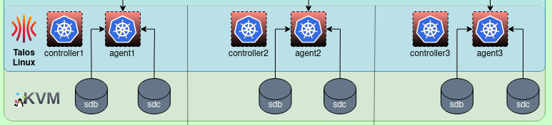
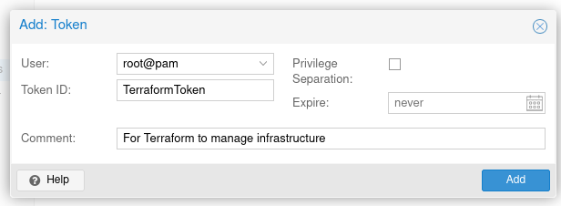
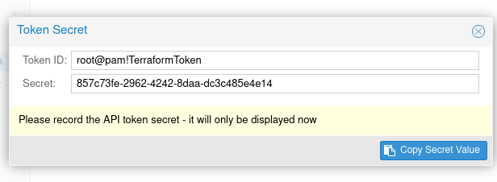
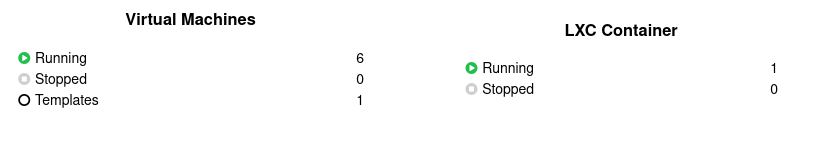

# Setting up the VMs


# OpenTofu (Terraform)

Using [OpenTofu](https://opentofu.org/) (or [Terraform](https://www.terraform.io/)) to manage in infrastructure.

## Required extension

* [Telmate Proxmox Extension](https://registry.terraform.io/providers/Telmate/proxmox/latest/docs/resources/vm_qemu)

# Create kubernetes node using "Infrastructure as Code" (IaC)

You could manually define all the nodes in your Kubernetes cluster but that is error-prone, so I use
[Terraform](https://www.terraform.io/) to define and create the cluster nodes.

# Proxmox

Setting up Proxmox for the installation.

## Talos Linux

[Talos Linux](https://www.talos.dev/) has a great site about installing on
[Proxmox](https://www.talos.dev/v1.5/talos-guides/install/virtualized-platforms/proxmox/), I use IaaS on top of their
recommended installation procedure.

Download a copy of the latest release from
their [repository](https://github.com/siderolabs/talos/releases) (currently `talos-v1.5.4-amd64.iso`).

Upload it to Proxmox, on my machine I put it on the `cephfs` drive in the `iso` folder. 

## Remote access API key

You have to have a remote access API key with full administrator rights.

`Datacenter` --> `Permissions` --> `API Tokens` -- `[Add]`

Create a new token for `root@pam`, the `Token ID` (`TerraformToken`) is the name of the token and also deselect `Priviledge Separation [ ]`.



You'll see a dialog with the details of the generated token:


<dl>
<dt>Token ID</dt><dd>root@pam!TerraformToken</dd>
<dt>Secret</dt><dd>857c73fe-2962-4242-8daa-dc3c485e4e14</dd>
</dl>

Record the details somewhere, like BitWarden, you'll need them for terraform to access Proxmox.


# Included files

## credentails.auto.tfvars

```terraform
proxmox_api_url = "https://192.168.122.201:8006/api2/json"
proxmox_api_token_id = "root@pam!TerraformToken"
proxmox_api_token_secret = "857c73fe-2962-4242-8daa-dc3c485e4e14"
```

## provider.tf

[provider.tf](provider.tf) - 
Defines the Proxmox provider

## main.tf

[main.tf](main.tf) - The main configuration for the VMs.

Describes how the variables defined in [virtualmachines.auto.tfvars](virtualmachines.auto.tfvars),
the name of the variable also identifies the file name: 
```terraform
variable "virtualmachines" {
  type = map(object({
    vmid = number
    instance_label = string
    instance_name = string
    instance_drive_size = string
    instance_memory_kb = number
    target_node = string
    macaddr = string
  }))
}
```
Define the machines based on the values in [virtualmachines](virtualmachines.auto.tfvars)
```terraform
resource "proxmox_vm_qemu" "talos-node" {
  lifecycle {
    create_before_destroy = false
    prevent_destroy = true
    ignore_changes = []
  }

  # define the machines
  for_each = var.virtualmachines
  ...
}
```

# Creating the VMs

## Load the extension
```shell
tofu init
```
```shell
terraform init
```

## Make sure everything looks correct
```shell
tofu validate
```
```shell
terraform validate
```

## Plan the changes
```shell
tofu plan
```
```shell
terraform plan
```

## Apply the changes
```shell
tofu apply
```
```shell
terraform apply
```
or . . .
```shell
tofu apply -auto-approve
```
```shell
terraform apply -auto-approve
```

The Datacenter summary will now show 6 virtual machines running and a template:


# Pass through drives for container storage

Making host drives available to the containers.

_Only required if you are intending to run an in cluster storage provider like [rook](https://rook.io/)_

See: [Manual: qm.conf](https://pve.proxmox.com/wiki/Manual:_qm.conf)

On each machine list the drive serial numbers:

```shell
$ lsblk --output NAME,SERIAL
NAME                  SERIAL
sda                   SERIAL001
├─sda1                
├─sda2                
└─sda3                
├─pve-swap            
├─pve-root            
├─pve-data_tmeta      
│ └─pve-data-tpool    
│   └─pve-data        
└─pve-data_tdata      
└─pve-data-tpool      
└─pve-data            
sdb                   SERIAL123
sdc                   SERIAL234
```

Identify the devices by their id:
```shell
ls -l  /dev/disk/by-id/ | grep -E "/sd[a-c]$"
lrwxrwxrwx 1 root root  9 Oct 15 09:04 ata-Samsung_SERIAL001 -> ../../sda
lrwxrwxrwx 1 root root  9 Oct 15 15:24 ata-Samsung_SERIAL123 -> ../../sdb
lrwxrwxrwx 1 root root  9 Oct 15 15:24 ata-Samsung_SERIAL123 -> ../../sdc```
```

On the nodes add the drives to the configurations.

## pvepr0


```shell
qm set 551 -scsi1 /dev/disk/by-id/ata-Samsung_SERIAL123,serial=SERIAL123
qm set 551 -scsi2 /dev/disk/by-id/ata-Samsung_SERIAL234,serial=SERIAL234
```

## pvepr1

```shell
qm set 552 -scsi1 /dev/disk/by-id/ata-Samsung_SERIAL345,serial=SERIAL345
qm set 552 -scsi2 /dev/disk/by-id/ata-Samsung_SERIAL678,serial=SERIAL678
```

## pvepr2

```shell
qm set 553 -scsi1 /dev/disk/by-id/ata-Samsung_SERIAL789,serial=SERIAL789
qm set 553 -scsi2 /dev/disk/by-id/ata-Samsung_SERIAL890,serial=SERIAL890
```
